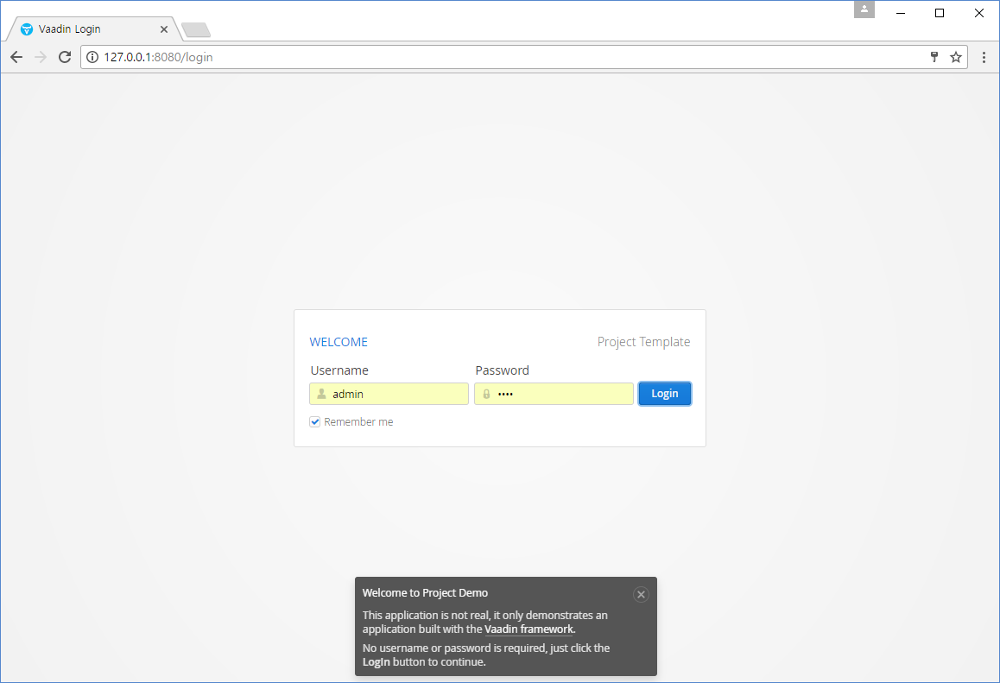
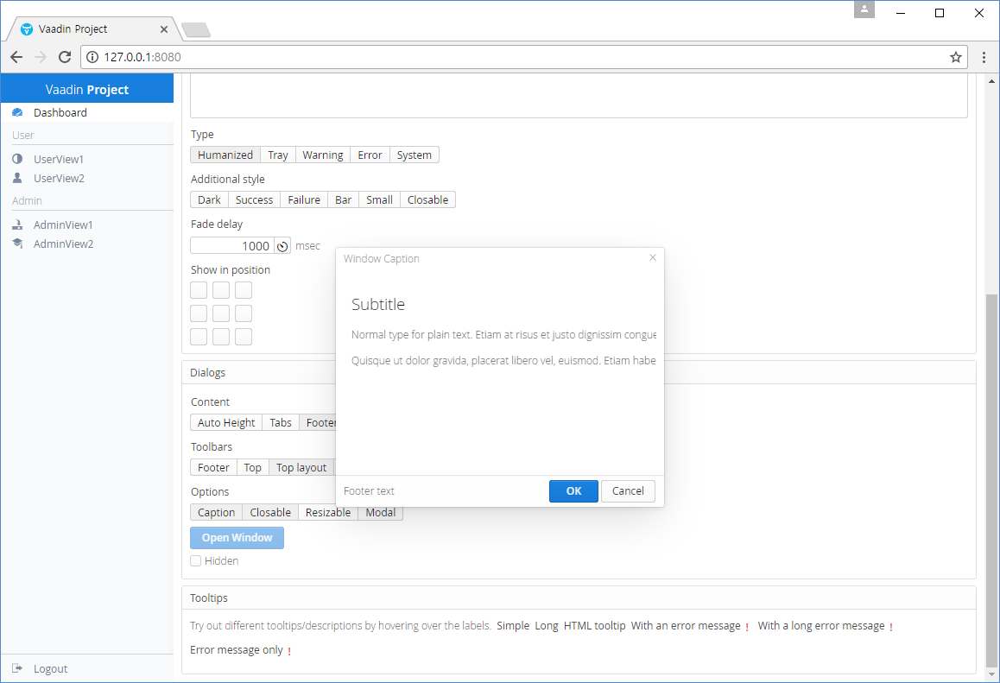
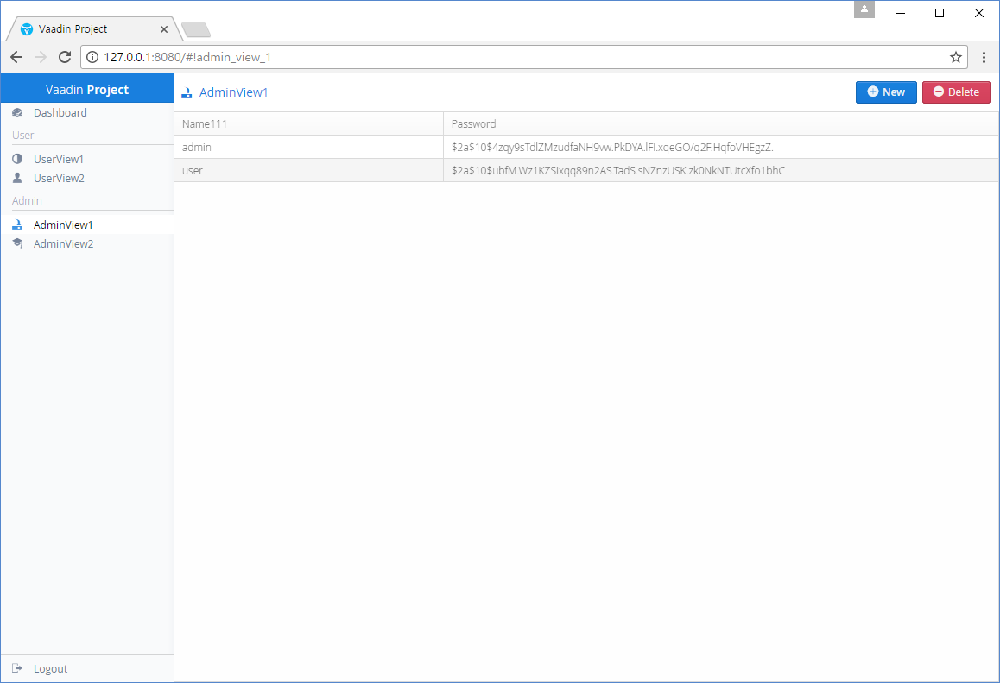
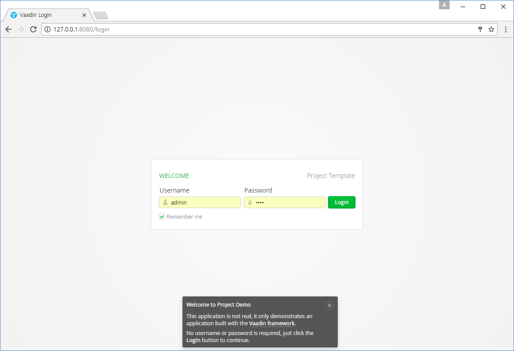
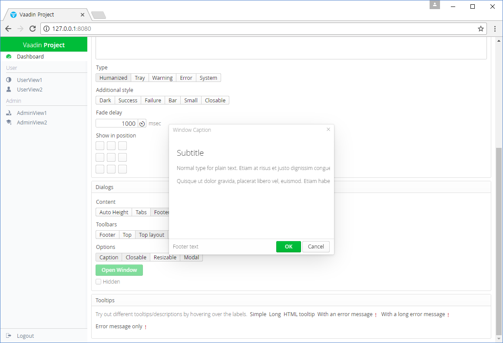
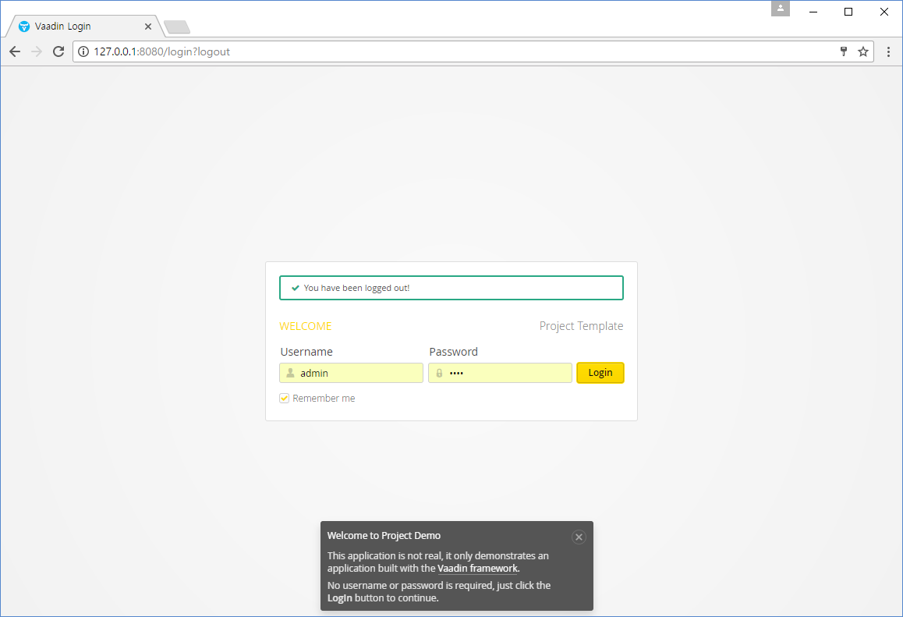
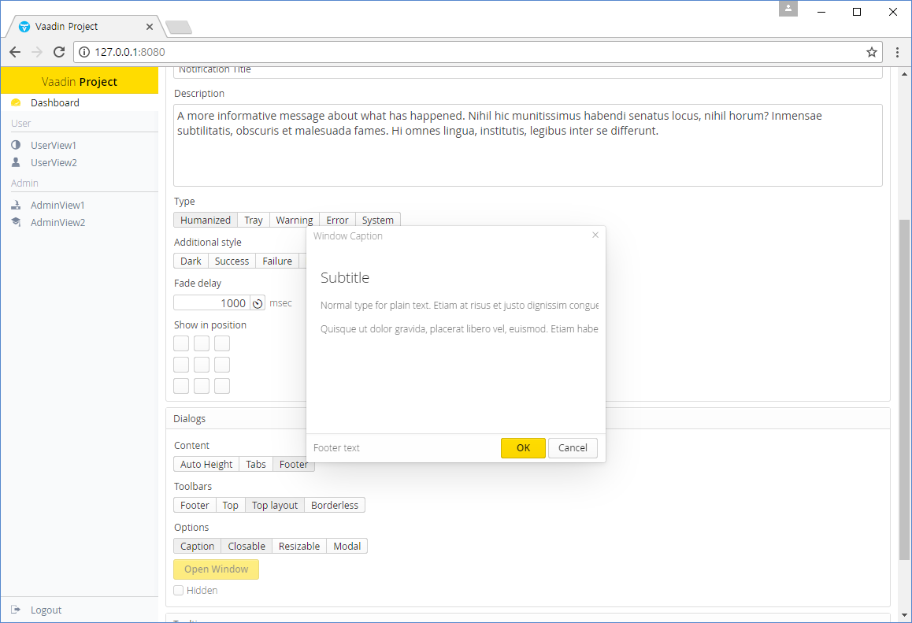
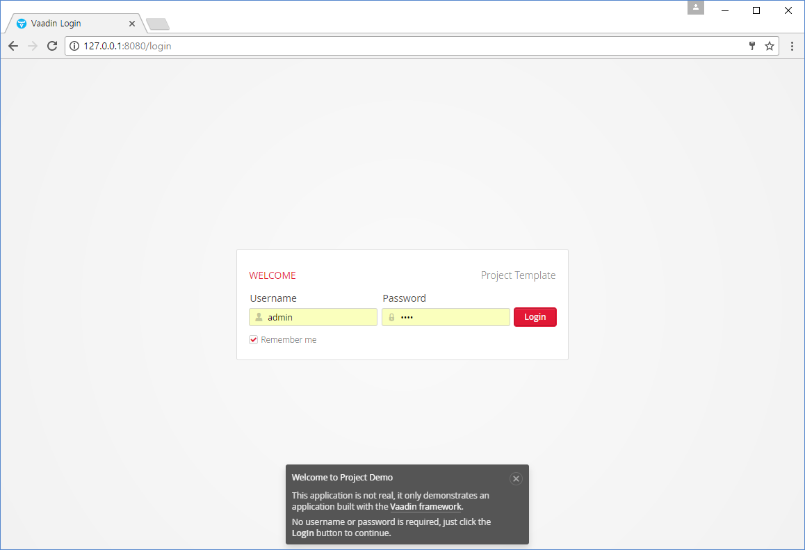
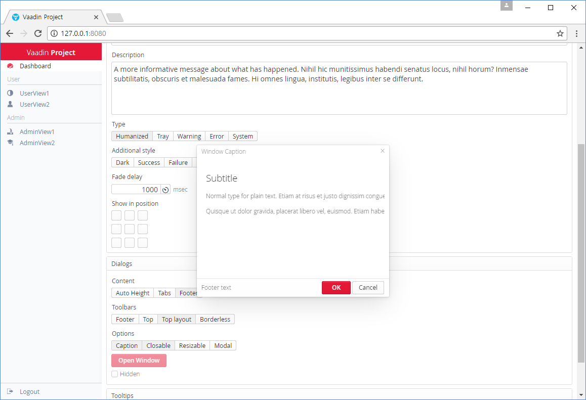

=  Vaadin Start Template

Vaadin8(+theme customizing), Spring Boot, Spring Security(+JPA)

## 4 themes

com.basakpie.ui.LoginUI.java
[source,java,indent=0]
----
@Theme("valo-default")
@SpringUI(path = "/login")
public class LoginUI extends UI {
----

com.basakpie.ui.MainUI.java
[source,java,indent=0]
----
@Theme("valo-default")
@SpringUI(path = "/")
public class MainUI extends UI {
----

**1. @Theme("vaadin-default")**

.Login

.Dashboard

.Grid

**2. @Theme("vaadin-green")**

.Login

.Dashboard

**3. @Theme("vaadin-yellow")**

.Login

.Dashboard

**4. @Theme("vaadin-red")**

.Login

.Dashboard

## Building and running demo

Linux/Mac

[source,groovy,indent=0]
----
sh gradlew clean build
sh gradlew bootRun
----

Windows

[source,groovy,indent=0]
----
gradlew.bat clean build
gradlew.bat bootRun
----

Demo Server : http://127.0.0.1:8080

Demo Username/Password : user/1234 or admin/1234

== Building from source

requires Java SE 1.8+

requires Gradle 3.+

requires Vaadin 8.+

requires SpringBoot 1.4+

requires SpringSecurity 4.1+
